<!-- Logo placeholder -->
<p align="center">
  <strong>pg-warehouse</strong>
</p>

<p align="center">
  Mirror PostgreSQL &rarr; DuckDB. Build versioned analytical releases. Export Parquet. No cloud required.
</p>

<p align="center">
  <a href="https://github.com/burnside-project/pg-warehouse/actions"></a>
  <a href="https://github.com/burnside-project/pg-warehouse/releases"></a>
  <a href="LICENSE"></a>
  <a href="https://img.shields.io/github/go-mod/go-version/burnside-project/pg-warehouse"></a>
  <a href="https://github.com/burnside-project/pg-warehouse/stargazers"></a>
</p>

## Why pg-warehouse?

Getting data out of PostgreSQL for analytics or ML usually means stitching together
Python scripts, cron jobs, and a cloud warehouse you don't need. pg-warehouse replaces that with
a single binary: sync tables into an embedded DuckDB, build versioned analytical releases,
and export to Parquet or CSV. Everything runs locally, on your machine, with no external dependencies.

## What makes pg-warehouse a local-first Data Warehouse?

| Features              | Exist ? |
|-----------------------|---------|
| Analytical Storage (Columnar + Optimized for Reads) | ✅       |
| Separation from OLTP (Workload Isolation) | ✅       |
| SQL Analytical Engine | ✅       |
| Data Transformation Layer (ETL / ELT) | ✅       |
| Durable Analytical Storage (Files or Tables) | ✅       |

## Quick comparison

| | pg-warehouse | pg_dump | Airbyte | dbt |
|---|---|---|---|---|
| PostgreSQL sync | Full, incremental, CDC | Full only | Full, incremental, CDC | -- |
| Local analytics | DuckDB (columnar) | -- | -- | DuckDB adapter |
| Parquet/CSV export | Built-in | -- | Via connectors | Via packages |
| Model graph (DAG) | Built-in | -- | -- | Core strength |
| Contracts | Built-in | -- | -- | Via packages |
| Infrastructure | Single binary | Single binary | Docker + Java | Python + adapter |
| Cloud required | No | No | Optional | Optional |

## What does it solve?
A local-first Data Warehouse engine that mirrors PostgreSQL data into DuckDB using native PostgreSQL CDC.
Best for teams that want CDC + SQL transforms + Parquet without standing up Kafka, Spark, or a warehouse.

## How does it work?

pg-warehouse uses three DuckDB files following Medallion Architecture:

| File | Layer | Purpose |
|------|-------|---------|
| `raw.duckdb` | Bronze | CDC black box. Deduped PostgreSQL mirror. CDC owns it exclusively. |
| `silver.duckdb` | Silver | Development platform. v0 = raw snapshot, v1 = your models. |
| `feature.duckdb` | Gold | Analytics output. v0 = silver snapshot, v1 = your features. |

Models use `ref()` for dependencies. pg-warehouse resolves the DAG and builds in the correct order.

---
> ### Refresh — snapshot raw CDC data into silver v0 (14 tables, ~12s)
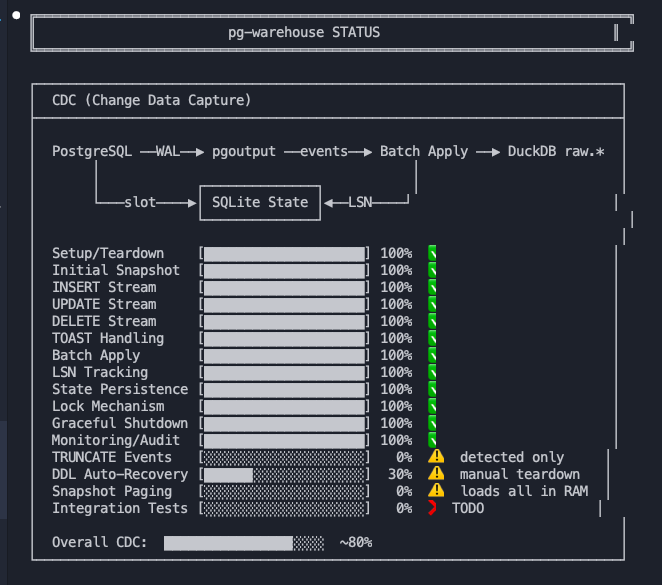
---
> ### Build — resolve DAG and build all 6 models: silver → feature → Parquet
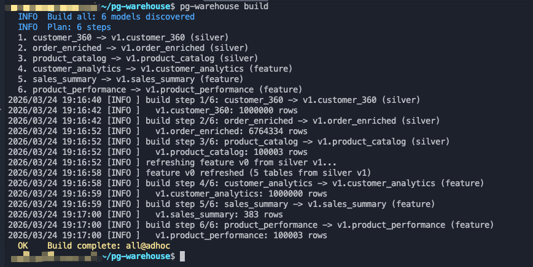
---
> ### Validate — check contracts, models, graph, releases (zero errors = green)
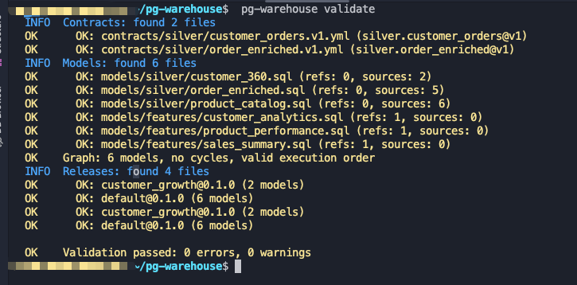
---
> ### Graph — show model dependency DAG (who depends on whom)
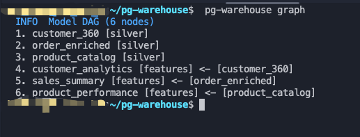
---
> ### Contracts — list registered data shape contracts
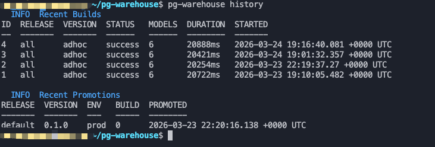
---
> ### Releases — list versioned release definitions
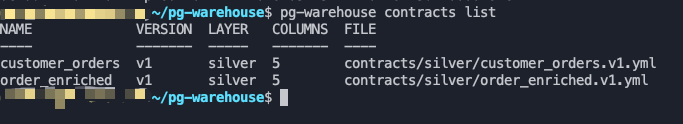
---
> ### Promote — deploy a release to an environment (dev/staging/prod)
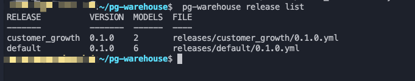
---
> ### Inspect — list all tables across all DuckDB files
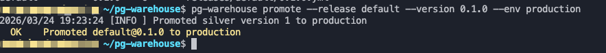
---
> ### CDC Status — check replication health (lag, slot, streaming)
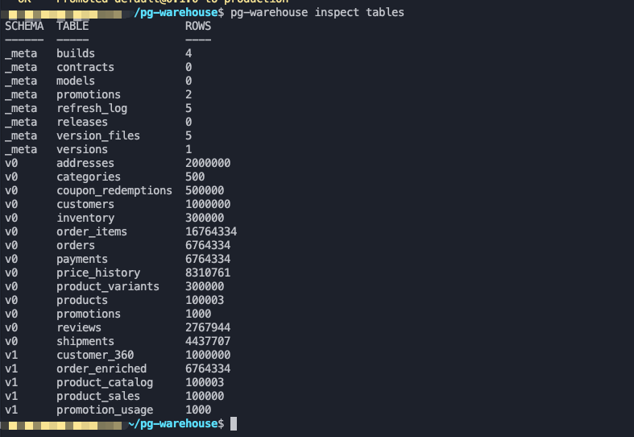
---
> ### Repair — fix orphaned builds and stale locks
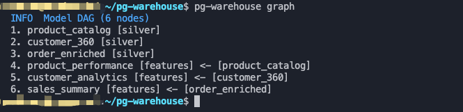
---
> ### Pipeline History
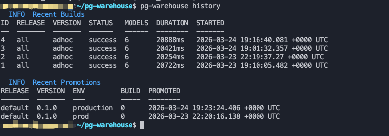


## Documentation

| Doc | Description |
|-----|-------------|
| [Architecture](docs/01-architecture.md) | Hexagonal design, layers, port interfaces |
| [Quickstart](docs/02-quickstart.md) | Full walkthrough with examples |
| [State Database](docs/03-state-db.md) | SQLite schema and semantics |
| [CDC Guide](docs/04-cdc.md) | Logical replication setup and lifecycle |
| [Sync Modes](docs/05-sync.md) | Full vs. incremental vs. CDC |
| [Configuration](docs/06-configuration.md) | YAML reference |
| [Open-Core Strategy](docs/07-open-core.md) | OSS vs. commercial boundary |
| [Development Workflow](docs/08-development-workflow.md) | Models, contracts, DAG-resolved builds |
| [Multi-DuckDB Architecture](docs/09-multi-duckdb-architecture.md) | Zero-downtime CDC with three DuckDB files |


```bash
pg-warehouse refresh     # snapshot raw → silver v0
pg-warehouse build       # build all models in DAG order
```

https://github.com/burnside-project/pg-warehouse/blob/main/docs/08-development-workflow.md

## Install

**Homebrew** (macOS / Linux):
```bash
brew install burnside-project/tap/pg-warehouse
```

**Go install**:
```bash
go install github.com/burnside-project/pg-warehouse/cmd/pg-warehouse@latest
```

**Download binary** — see [Releases](https://github.com/burnside-project/pg-warehouse/releases) for Linux, macOS, and Windows (amd64/arm64).

**Build from source**:
```bash
git clone https://github.com/burnside-project/pg-warehouse.git
cd pg-warehouse
make build
```

## Deployment Layout

pg-warehouse runs from a single working directory. All paths in `pg-warehouse.yml` are relative to this directory.

```
~/pg-warehouse/                  # Working directory
├── pg-warehouse                 # Binary
├── pg-warehouse.yml             # Configuration
├── raw.duckdb                   # CDC black box
├── silver.duckdb                # Silver development platform
├── feature.duckdb               # Feature analytics output
├── .pgwh/
│   └── state.db                 # SQLite state (sync/CDC/builds)
├── models/
│   ├── silver/                  # Silver layer SQL models
│   └── features/                # Feature layer SQL models
├── contracts/                   # Data contracts (YAML)
├── releases/                    # Release definitions (YAML)
├── out/                         # Parquet/CSV exports
└── cdc.log                      # CDC log (when running via nohup)
```

## Quickstart (2 minutes)

**1. Initialize** — creates DuckDB files, state DB, and scaffolds directories:

```console
$ mkdir -p ~/pg-warehouse && cd ~/pg-warehouse
$ pg-warehouse init --config pg-warehouse.yml
```

**2. Start CDC** — stream changes from PostgreSQL:

```console
$ pg-warehouse cdc setup --config pg-warehouse.yml
$ nohup pg-warehouse cdc start --config pg-warehouse.yml > cdc.log 2>&1 &
```

**3. Refresh** — snapshot raw data into silver v0:

```console
$ pg-warehouse refresh
```

**4. Build** — build all models in DAG order:

```console
$ pg-warehouse build
```

**5. Validate** — check contracts, models, DAG, releases:

```console
$ pg-warehouse validate
```

## Features

**Sync**
- [x] Full table snapshots
- [x] Incremental sync via watermark columns
- [x] CDC streaming via PostgreSQL logical replication (pglogrepl)
- [x] Automatic sync mode detection per table

**Analytical Releases**
- [x] Models with `ref()` and `source()` dependency declarations
- [x] DAG-resolved build ordering (topological sort, cycle detection)
- [x] Data contracts (YAML) for schema validation
- [x] Named releases with versioned model bundles
- [x] Terraform-style `--plan` with SQL validation via EXPLAIN
- [x] Build history and promotion tracking in `_meta`
- [x] Partial builds: `build --select model_name`

**Multi-DuckDB Architecture**
- [x] 3-file isolation: raw (CDC), silver (transforms), feature (analytics)
- [x] Zero-downtime CDC — pipeline never stops CDC
- [x] Reserved schema protection (raw, stage, v0, _meta) with DANGER enforcement
- [x] CDC guardrails: max_lag_bytes, drop_slot_on_exit, health checks

**Export**
- [x] Parquet export
- [x] CSV export

**Developer Experience**
- [x] Single binary, zero external dependencies
- [x] `validate` command for contracts, models, DAG, and SQL
- [x] `graph` command to visualize model dependencies
- [x] `history` command for build and promotion audit trail
- [x] SQLite state tracking that survives warehouse rebuilds
- [x] `repair` command for fixing orphaned builds

## Commands

| Command | What it does |
|---------|-------------|
| `refresh` | Snapshot raw.duckdb → silver.duckdb v0 |
| `validate` | Check contracts, models, DAG, releases, SQL syntax |
| `build` | Build all models in DAG order |
| `build --release X --version Y` | Build a specific release |
| `build --select model_name` | Build one model + its dependencies |
| `graph` | Show model dependency DAG |
| `history` | Build + promotion history |
| `contracts list` | List data contracts |
| `release list` | List releases |
| `promote --release X --version Y --env E` | Promote to environment |
| `inspect tables` | List all DuckDB tables |
| `cdc status` | Check CDC health |
| `repair` | Fix orphaned builds, stale locks |

## E-Commerce Recipe

A complete working example with 14 source tables, 6 models, contracts, and releases:

```bash
pg-warehouse refresh
pg-warehouse build
```

See [examples/ecommerce-recipe/README.md](examples/ecommerce-recipe/README.md) for full details including dashboard and AI Q&A.

## Architecture

pg-warehouse uses hexagonal architecture with clean port/adapter separation. The CLI layer (Cobra) calls services that depend only on port interfaces. Adapters for PostgreSQL, DuckDB, SQLite, Parquet, and CSV implement those interfaces. New sources, warehouses, and exporters plug in without changing business logic.

See [docs/01-architecture.md](docs/01-architecture.md) for the full design.

## Open Core

The open-source edition covers the full developer workflow: sync, CDC, DuckDB, model graph, contracts, releases, and local export. Production operations -- scheduling, cloud storage export (S3/GCS/Iceberg), remote state, RBAC, and lineage -- are commercial.

See [docs/07-open-core.md](docs/07-open-core.md) for the boundary details.

## Community

- [GitHub Issues](https://github.com/burnside-project/pg-warehouse/issues) -- Bugs and feature requests
- [GitHub Discussions](https://github.com/burnside-project/pg-warehouse/discussions) -- Questions and ideas
- [Contributing](CONTRIBUTING.md) -- Development setup and guidelines
- [Code of Conduct](CODE_OF_CONDUCT.md)
- [Security Policy](SECURITY.md)
<!-- - [Discord](https://discord.gg/placeholder) -- Chat with the community -->

## License

[Apache License 2.0](LICENSE) -- Copyright 2025-2026 [Burnside Project](https://burnsideproject.ai)
